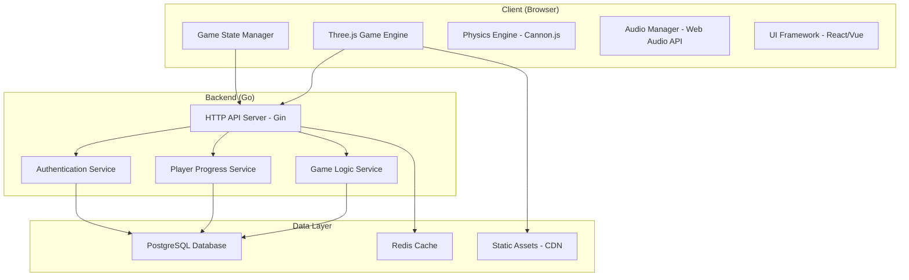

# Design Document

## Overview

The Zombie Car Game is a browser-based 3D action game built with Three.js frontend and Go backend. Players drive customizable vehicles through zombie-infested levels, earning points and currency to unlock new cars and upgrades. The game features physics-based driving mechanics, diverse zombie AI, comprehensive progression systems, and professional-grade visuals optimized for web deployment.

## Architecture

### High-Level Architecture



### Technology Stack

**Frontend:**
- **Three.js** - 3D graphics rendering and scene management
- **Cannon.js** - Physics simulation for realistic car movement and collisions
- **React** - UI components and state management
- **Web Audio API** - Spatial audio and sound effects
- **Webpack** - Module bundling and optimization

**Backend:**
- **Go** - High-performance backend services
- **Gin** - HTTP web framework
- **GORM** - Database ORM
- **JWT** - Authentication tokens
- **WebSocket** - Real-time communication (future multiplayer support)

**Data Storage:**
- **PostgreSQL** - Primary database for player data and game state
- **Redis** - Session management and caching
- **AWS S3/CloudFront** - Static asset delivery

## Components and Interfaces

### Frontend Components

#### 1. Game Engine Core (`GameEngine`)
```typescript
interface GameEngine {
  scene: THREE.Scene
  camera: THREE.PerspectiveCamera
  renderer: THREE.WebGLRenderer
  physics: CANNON.World
  
  initialize(): void
  update(deltaTime: number): void
  render(): void
  dispose(): void
}
```

#### 2. Vehicle System (`VehicleManager`)
```typescript
interface Vehicle {
  id: string
  type: VehicleType
  stats: VehicleStats
  upgrades: UpgradeSet
  mesh: THREE.Group
  body: CANNON.Body
}

interface VehicleStats {
  speed: number
  acceleration: number
  armor: number
  fuelCapacity: number
  damage: number
  handling: number
}

enum VehicleType {
  SEDAN, SUV, TRUCK, SPORTS_CAR, MONSTER_TRUCK, 
  ARMORED_CAR, BUGGY, MOTORCYCLE, TANK, HOVERCRAFT,
  MUSCLE_CAR, RACING_CAR
}
```

#### 3. Zombie System (`ZombieManager`)
```typescript
interface Zombie {
  id: string
  type: ZombieType
  health: number
  speed: number
  pointValue: number
  mesh: THREE.Group
  body: CANNON.Body
  ai: ZombieAI
}

enum ZombieType {
  WALKER, RUNNER, CRAWLER, SPITTER, BLOATER,
  ARMORED, GIANT, SCREAMER, EXPLODER, TOXIC,
  BERSERKER, LEAPER, STALKER, BRUTE, SWARM,
  BOSS_TYRANT, BOSS_HORDE_MASTER, BOSS_MUTANT,
  BOSS_NECROMANCER, BOSS_ABOMINATION
}
```

#### 4. Upgrade System (`UpgradeManager`)
```typescript
interface UpgradeCategory {
  ENGINE: EngineUpgrade[]
  ARMOR: ArmorUpgrade[]
  WEAPONS: WeaponUpgrade[]
  FUEL: FuelUpgrade[]
  TIRES: TireUpgrade[]
}

interface Upgrade {
  id: string
  name: string
  description: string
  cost: number
  level: number
  maxLevel: number
  effect: UpgradeEffect
}
```

#### 5. Level System (`LevelManager`)
```typescript
interface Level {
  id: string
  name: string
  terrain: TerrainData
  zombieSpawns: SpawnPoint[]
  objectives: Objective[]
  unlockRequirements: UnlockCriteria
}

interface TerrainData {
  heightMap: number[][]
  obstacles: Obstacle[]
  checkpoints: Checkpoint[]
  environmentType: EnvironmentType
}
```

### Backend Services

#### 1. Player Service
```go
type PlayerService struct {
    db *gorm.DB
    cache *redis.Client
}

type Player struct {
    ID       uint   `gorm:"primaryKey"`
    Username string `gorm:"unique"`
    Currency int
    Level    int
    Progress PlayerProgress
    Vehicles []OwnedVehicle
}

func (s *PlayerService) GetPlayer(id uint) (*Player, error)
func (s *PlayerService) UpdateProgress(id uint, progress PlayerProgress) error
func (s *PlayerService) PurchaseVehicle(playerID uint, vehicleID string) error
```

#### 2. Game State Service
```go
type GameStateService struct {
    db *gorm.DB
}

type GameSession struct {
    ID       string
    PlayerID uint
    LevelID  string
    Score    int
    State    SessionState
    StartTime time.Time
}

func (s *GameStateService) StartSession(playerID uint, levelID string) (*GameSession, error)
func (s *GameStateService) UpdateScore(sessionID string, score int) error
func (s *GameStateService) EndSession(sessionID string) (*GameResult, error)
```

## Data Models

### Database Schema

```sql
-- Players table
CREATE TABLE players (
    id SERIAL PRIMARY KEY,
    username VARCHAR(50) UNIQUE NOT NULL,
    email VARCHAR(100) UNIQUE NOT NULL,
    password_hash VARCHAR(255) NOT NULL,
    currency INTEGER DEFAULT 0,
    level INTEGER DEFAULT 1,
    total_score BIGINT DEFAULT 0,
    created_at TIMESTAMP DEFAULT NOW(),
    updated_at TIMESTAMP DEFAULT NOW()
);

-- Owned vehicles
CREATE TABLE owned_vehicles (
    id SERIAL PRIMARY KEY,
    player_id INTEGER REFERENCES players(id),
    vehicle_type VARCHAR(50) NOT NULL,
    upgrades JSONB DEFAULT '{}',
    purchased_at TIMESTAMP DEFAULT NOW()
);

-- Game sessions
CREATE TABLE game_sessions (
    id UUID PRIMARY KEY DEFAULT gen_random_uuid(),
    player_id INTEGER REFERENCES players(id),
    level_id VARCHAR(50) NOT NULL,
    score INTEGER DEFAULT 0,
    zombies_killed INTEGER DEFAULT 0,
    distance_traveled FLOAT DEFAULT 0,
    session_state VARCHAR(20) DEFAULT 'active',
    started_at TIMESTAMP DEFAULT NOW(),
    ended_at TIMESTAMP
);

-- Level progress
CREATE TABLE level_progress (
    id SERIAL PRIMARY KEY,
    player_id INTEGER REFERENCES players(id),
    level_id VARCHAR(50) NOT NULL,
    best_score INTEGER DEFAULT 0,
    completed BOOLEAN DEFAULT FALSE,
    stars_earned INTEGER DEFAULT 0,
    UNIQUE(player_id, level_id)
);
```

### Game Configuration Data

#### Vehicle Configurations
```json
{
  "vehicles": {
    "sedan": {
      "name": "Family Sedan",
      "baseStats": {
        "speed": 60,
        "acceleration": 40,
        "armor": 30,
        "fuelCapacity": 100,
        "damage": 25,
        "handling": 70
      },
      "cost": 0,
      "unlockLevel": 1
    },
    "monster_truck": {
      "name": "Monster Crusher",
      "baseStats": {
        "speed": 45,
        "acceleration": 30,
        "armor": 80,
        "fuelCapacity": 150,
        "damage": 60,
        "handling": 40
      },
      "cost": 5000,
      "unlockLevel": 5
    }
  }
}
```

#### Zombie Configurations
```json
{
  "zombies": {
    "walker": {
      "name": "Walker",
      "health": 50,
      "speed": 10,
      "pointValue": 10,
      "spawnWeight": 60
    },
    "boss_tyrant": {
      "name": "Tyrant",
      "health": 1000,
      "speed": 25,
      "pointValue": 500,
      "spawnWeight": 1,
      "specialAbilities": ["charge", "roar"]
    }
  }
}
```

## Error Handling

### Frontend Error Handling
- **Asset Loading Errors**: Graceful fallbacks for missing models/textures
- **Physics Simulation Errors**: Reset mechanisms for unstable physics states
- **Network Errors**: Retry logic with exponential backoff
- **Performance Issues**: Dynamic quality adjustment based on frame rate

### Backend Error Handling
```go
type APIError struct {
    Code    int    `json:"code"`
    Message string `json:"message"`
    Details string `json:"details,omitempty"`
}

func HandleError(c *gin.Context, err error) {
    switch e := err.(type) {
    case *ValidationError:
        c.JSON(400, APIError{Code: 400, Message: "Validation failed", Details: e.Error()})
    case *NotFoundError:
        c.JSON(404, APIError{Code: 404, Message: "Resource not found"})
    case *DatabaseError:
        c.JSON(500, APIError{Code: 500, Message: "Internal server error"})
    default:
        c.JSON(500, APIError{Code: 500, Message: "Unknown error"})
    }
}
```

## Testing Strategy

### Frontend Testing
- **Unit Tests**: Jest for game logic components
- **Integration Tests**: Testing Three.js scene interactions
- **Performance Tests**: Frame rate monitoring and memory usage
- **Cross-browser Tests**: Compatibility across major browsers

### Backend Testing
```go
func TestPlayerService_PurchaseVehicle(t *testing.T) {
    // Setup test database
    db := setupTestDB()
    service := NewPlayerService(db, nil)
    
    // Test successful purchase
    player := createTestPlayer(1000) // 1000 currency
    err := service.PurchaseVehicle(player.ID, "suv")
    assert.NoError(t, err)
    
    // Test insufficient funds
    err = service.PurchaseVehicle(player.ID, "tank") // Expensive vehicle
    assert.Error(t, err)
    assert.Contains(t, err.Error(), "insufficient funds")
}
```

### Game Balance Testing
- **Automated gameplay simulations** to test progression curves
- **Performance benchmarks** for different device capabilities
- **Load testing** for concurrent player scenarios

## Performance Optimization

### Frontend Optimizations
- **Level-of-Detail (LOD)**: Reduce polygon count for distant objects
- **Frustum Culling**: Only render objects in camera view
- **Object Pooling**: Reuse zombie and particle objects
- **Texture Atlasing**: Combine textures to reduce draw calls
- **Progressive Loading**: Load assets as needed during gameplay

### Backend Optimizations
- **Database Indexing**: Optimize queries for player data retrieval
- **Caching Strategy**: Redis for frequently accessed game data
- **Connection Pooling**: Efficient database connection management
- **Horizontal Scaling**: Load balancer for multiple server instances

### Asset Optimization
- **Model Compression**: Optimize 3D models for web delivery
- **Texture Compression**: Use appropriate formats (WebP, compressed textures)
- **Audio Compression**: Optimize sound files for streaming
- **CDN Distribution**: Global asset delivery network

## Security Considerations

### Client-Side Security
- **Input Validation**: Sanitize all user inputs
- **Anti-Cheat Measures**: Server-side score validation
- **Rate Limiting**: Prevent API abuse

### Server-Side Security
```go
func AuthMiddleware() gin.HandlerFunc {
    return func(c *gin.Context) {
        token := c.GetHeader("Authorization")
        if token == "" {
            c.JSON(401, gin.H{"error": "No authorization token"})
            c.Abort()
            return
        }
        
        claims, err := ValidateJWT(token)
        if err != nil {
            c.JSON(401, gin.H{"error": "Invalid token"})
            c.Abort()
            return
        }
        
        c.Set("playerID", claims.PlayerID)
        c.Next()
    }
}
```

## Deployment Architecture

### Production Environment
```yaml
# docker-compose.yml
version: '3.8'
services:
  frontend:
    build: ./frontend
    ports:
      - "80:80"
    environment:
      - API_URL=http://backend:8080
  
  backend:
    build: ./backend
    ports:
      - "8080:8080"
    environment:
      - DB_HOST=postgres
      - REDIS_HOST=redis
    depends_on:
      - postgres
      - redis
  
  postgres:
    image: postgres:14
    environment:
      - POSTGRES_DB=zombie_game
      - POSTGRES_USER=gameuser
      - POSTGRES_PASSWORD=gamepass
    volumes:
      - postgres_data:/var/lib/postgresql/data
  
  redis:
    image: redis:7-alpine
    volumes:
      - redis_data:/data
```

### CI/CD Pipeline
- **Build Stage**: Compile and bundle frontend assets
- **Test Stage**: Run automated test suites
- **Deploy Stage**: Deploy to staging/production environments
- **Monitoring**: Application performance and error tracking