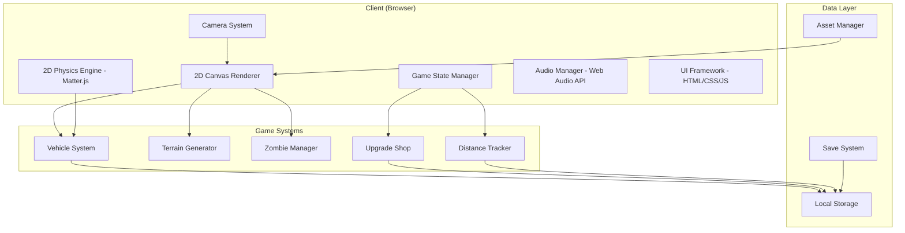

# Design Document

## Overview

The Zombie Car Game is a 2D side-scrolling vehicle upgrade survival game set in a post-apocalyptic desert environment. Players start with a basic, run-down car and drive from left to right through zombie-infested wasteland toward a distant safe zone. The core gameplay loop involves daily runs where players drive as far as possible until fuel runs out or the vehicle is destroyed, earning money to purchase upgrades between runs. The game features semi-realistic 2D physics, uneven terrain, distinctive post-apocalyptic visuals, and a fixed side-view camera that follows the vehicle.

## Architecture

### High-Level Architecture



### Technology Stack

**Frontend:**
- **HTML5 Canvas** - 2D graphics rendering and sprite management
- **Matter.js** - 2D physics simulation for realistic vehicle movement and collisions
- **Vanilla JavaScript** - Core game logic and state management
- **Web Audio API** - Engine sounds, impact effects, and background music
- **CSS3** - UI styling and post-apocalyptic visual theme

**Game Engine:**
- **Custom 2D Engine** - Built specifically for side-scrolling vehicle gameplay
- **Sprite Animation System** - For vehicle and zombie animations
- **Particle System** - For dust, explosions, and impact effects
- **Terrain Generation** - Procedural and designed desert landscapes

**Data Storage:**
- **Local Storage** - Player progress, vehicle upgrades, and currency
- **JSON Configuration** - Vehicle stats, upgrade trees, and stage data
- **Asset Management** - Optimized loading of sprites, sounds, and terrain data

## Components and Interfaces

### Core Game Components

#### 1. Game Engine Core (`GameEngine`)
```javascript
class GameEngine {
  constructor() {
    this.canvas = null
    this.ctx = null
    this.physics = null // Matter.js engine
    this.camera = null
    this.gameState = 'menu' // menu, playing, paused, gameOver
    this.deltaTime = 0
  }
  
  initialize() { /* Setup canvas, physics, camera */ }
  update(deltaTime) { /* Update all game systems */ }
  render() { /* Draw all game objects */ }
  handleInput() { /* Process player input */ }
}
```

#### 2. Vehicle System (`Vehicle`)
```javascript
class Vehicle {
  constructor(type, upgrades = {}) {
    this.type = type
    this.position = { x: 0, y: 0 }
    this.velocity = { x: 0, y: 0 }
    this.rotation = 0
    this.fuel = 100
    this.health = 100
    this.upgrades = upgrades
    this.sprite = null
    this.physicsBody = null
  }
  
  // Base stats modified by upgrades
  get enginePower() { return this.baseStats.engine * (1 + this.upgrades.engine * 0.2) }
  get fuelCapacity() { return this.baseStats.fuel * (1 + this.upgrades.fuel * 0.3) }
  get armorStrength() { return this.baseStats.armor * (1 + this.upgrades.armor * 0.25) }
  get weaponDamage() { return this.baseStats.weapon * (1 + this.upgrades.weapon * 0.4) }
}

const VehicleTypes = {
  STARTER_CAR: { engine: 50, fuel: 100, armor: 30, weapon: 0, cost: 0 },
  OLD_TRUCK: { engine: 40, fuel: 150, armor: 60, weapon: 20, cost: 500 },
  SPORTS_CAR: { engine: 90, fuel: 80, armor: 20, weapon: 10, cost: 1200 },
  MONSTER_TRUCK: { engine: 70, fuel: 120, armor: 80, weapon: 40, cost: 2000 },
  ARMORED_VAN: { engine: 60, fuel: 110, armor: 100, weapon: 60, cost: 3500 }
}
```

#### 3. Zombie System (`ZombieManager`)
```javascript
class Zombie {
  constructor(type, x, y) {
    this.type = type
    this.position = { x, y }
    this.health = ZombieTypes[type].health
    this.speed = ZombieTypes[type].speed
    this.sprite = null
    this.physicsBody = null
    this.state = 'idle' // idle, moving, hit, dying
    this.animationFrame = 0
  }
  
  update(deltaTime) {
    // Simple AI: move toward vehicle or flail when hit
    if (this.state === 'hit') {
      this.playFlailAnimation()
    }
  }
  
  takeDamage(damage) {
    this.health -= damage
    this.state = 'hit'
    if (this.health <= 0) {
      this.state = 'dying'
    }
  }
}

const ZombieTypes = {
  WALKER: { health: 50, speed: 20, color: '#4a5d23' },
  CRAWLER: { health: 30, speed: 15, color: '#3d4a1f' },
  RUNNER: { health: 40, speed: 40, color: '#5a6d33' },
  BLOATER: { health: 100, speed: 10, color: '#6d7a43' },
  ARMORED: { health: 150, speed: 25, color: '#7a8750' }
}
```

#### 4. Upgrade System (`UpgradeShop`)
```javascript
class UpgradeShop {
  constructor() {
    this.categories = ['engine', 'fuel', 'armor', 'weapon', 'wheels']
    this.maxLevel = 5
  }
  
  getUpgradeCost(category, currentLevel) {
    const baseCosts = {
      engine: 100,
      fuel: 80,
      armor: 120,
      weapon: 150,
      wheels: 90
    }
    return baseCosts[category] * Math.pow(1.5, currentLevel)
  }
  
  purchaseUpgrade(vehicleId, category, playerMoney) {
    const vehicle = this.getVehicle(vehicleId)
    const currentLevel = vehicle.upgrades[category] || 0
    const cost = this.getUpgradeCost(category, currentLevel)
    
    if (playerMoney >= cost && currentLevel < this.maxLevel) {
      vehicle.upgrades[category] = currentLevel + 1
      return { success: true, newMoney: playerMoney - cost }
    }
    return { success: false, reason: 'insufficient_funds_or_max_level' }
  }
}

const UpgradeEffects = {
  engine: { stat: 'enginePower', multiplier: 0.2, visual: 'exhaust_smoke' },
  fuel: { stat: 'fuelCapacity', multiplier: 0.3, visual: 'fuel_tank_size' },
  armor: { stat: 'armorStrength', multiplier: 0.25, visual: 'armor_plating' },
  weapon: { stat: 'weaponDamage', multiplier: 0.4, visual: 'roof_mounted_gun' },
  wheels: { stat: 'traction', multiplier: 0.15, visual: 'tire_upgrade' }
}
```

#### 5. Terrain and Stage System (`TerrainGenerator`)
```javascript
class TerrainGenerator {
  constructor() {
    this.chunkSize = 1000 // pixels
    this.terrainHeight = 400
    this.obstacles = []
    this.zombieSpawns = []
  }
  
  generateChunk(chunkIndex, stageType) {
    const terrain = {
      heightMap: this.generateHeightMap(chunkIndex),
      obstacles: this.generateObstacles(chunkIndex, stageType),
      zombieSpawns: this.generateZombieSpawns(chunkIndex, stageType),
      background: this.getBackgroundType(stageType)
    }
    return terrain
  }
  
  generateHeightMap(chunkIndex) {
    // Create hills, ramps, dips using sine waves and noise
    const points = []
    for (let x = 0; x < this.chunkSize; x += 10) {
      const height = this.terrainHeight + 
        Math.sin(x * 0.01) * 50 + 
        Math.sin(x * 0.005) * 100 +
        (Math.random() - 0.5) * 20
      points.push({ x, y: height })
    }
    return points
  }
}

const StageTypes = {
  EARLY_DESERT: { 
    background: '#d4a574', 
    skyColor: '#ff8c42',
    zombieDensity: 0.3,
    obstacleTypes: ['small_rock', 'debris']
  },
  DEEP_WASTELAND: { 
    background: '#c49464', 
    skyColor: '#ff7a2e',
    zombieDensity: 0.5,
    obstacleTypes: ['wrecked_car', 'large_rock', 'debris']
  },
  FINAL_APPROACH: { 
    background: '#b48454', 
    skyColor: '#ff681a',
    zombieDensity: 0.8,
    obstacleTypes: ['tank_wreck', 'concrete_barrier', 'spike_trap']
  }
}
```

#### 6. Camera System (`Camera`)
```javascript
class Camera {
  constructor(canvas) {
    this.x = 0
    this.y = 0
    this.zoom = 1.0
    this.targetZoom = 1.0
    this.followTarget = null
    this.canvas = canvas
    this.smoothing = 0.1
  }
  
  followVehicle(vehicle) {
    this.followTarget = vehicle
  }
  
  update(deltaTime) {
    if (this.followTarget) {
      // Smooth camera following
      const targetX = this.followTarget.position.x - this.canvas.width / 2
      this.x += (targetX - this.x) * this.smoothing
      
      // Zoom out when airborne
      if (this.followTarget.isAirborne) {
        this.targetZoom = 0.8
      } else {
        this.targetZoom = 1.0
      }
      
      // Smooth zoom transition
      this.zoom += (this.targetZoom - this.zoom) * this.smoothing
    }
  }
  
  worldToScreen(worldX, worldY) {
    return {
      x: (worldX - this.x) * this.zoom,
      y: (worldY - this.y) * this.zoom
    }
  }
}
```

#### 7. Save System (`SaveManager`)
```javascript
class SaveManager {
  constructor() {
    this.saveKey = 'zombieCarGameSave'
  }
  
  saveGame(gameData) {
    const saveData = {
      money: gameData.money,
      currentStage: gameData.currentStage,
      vehicles: gameData.vehicles,
      upgrades: gameData.upgrades,
      bestDistance: gameData.bestDistance,
      totalRuns: gameData.totalRuns,
      timestamp: Date.now()
    }
    localStorage.setItem(this.saveKey, JSON.stringify(saveData))
  }
  
  loadGame() {
    const saved = localStorage.getItem(this.saveKey)
    if (saved) {
      return JSON.parse(saved)
    }
    return this.getDefaultSave()
  }
  
  getDefaultSave() {
    return {
      money: 0,
      currentStage: 0,
      vehicles: ['STARTER_CAR'],
      upgrades: { STARTER_CAR: {} },
      bestDistance: 0,
      totalRuns: 0
    }
  }
}
```

## Data Models

### Local Storage Schema

```javascript
// Main save data structure
const SaveData = {
  money: 0,                    // Currency earned from runs
  currentStage: 0,             // Current unlocked stage
  selectedVehicle: 'STARTER_CAR', // Currently selected vehicle
  vehicles: ['STARTER_CAR'],   // Array of owned vehicle types
  upgrades: {                  // Upgrade levels per vehicle
    'STARTER_CAR': {
      engine: 0,
      fuel: 0,
      armor: 0,
      weapon: 0,
      wheels: 0
    }
  },
  statistics: {
    bestDistance: 0,           // Furthest distance achieved
    totalRuns: 0,              // Number of runs completed
    totalZombiesKilled: 0,     // Lifetime zombie kills
    totalMoneyEarned: 0,       // Lifetime money earned
    gameCompleted: false       // Whether player reached evacuation point
  },
  settings: {
    masterVolume: 1.0,
    effectsVolume: 1.0,
    musicVolume: 0.7,
    showFPS: false
  }
}
```

### Game Configuration Data

#### Vehicle Configurations
```javascript
const VehicleConfig = {
  STARTER_CAR: {
    name: "Old Sedan",
    description: "A beat-up family car. It's not much, but it runs.",
    baseStats: { engine: 50, fuel: 100, armor: 30, weapon: 0 },
    cost: 0,
    unlockDistance: 0,
    sprite: "starter_car.png"
  },
  OLD_TRUCK: {
    name: "Rusty Pickup",
    description: "More durable than the sedan, with a bit more power.",
    baseStats: { engine: 60, fuel: 120, armor: 50, weapon: 10 },
    cost: 500,
    unlockDistance: 1000,
    sprite: "old_truck.png"
  },
  SPORTS_CAR: {
    name: "Desert Racer",
    description: "Fast and agile, but fragile in the wasteland.",
    baseStats: { engine: 90, fuel: 80, armor: 20, weapon: 5 },
    cost: 1200,
    unlockDistance: 2500,
    sprite: "sports_car.png"
  },
  MONSTER_TRUCK: {
    name: "Wasteland Crusher",
    description: "Built to smash through anything in its path.",
    baseStats: { engine: 70, fuel: 140, armor: 80, weapon: 30 },
    cost: 2500,
    unlockDistance: 5000,
    sprite: "monster_truck.png"
  },
  ARMORED_VAN: {
    name: "Fortress Van",
    description: "Heavy armor and mounted weapons for serious survival.",
    baseStats: { engine: 65, fuel: 110, armor: 100, weapon: 50 },
    cost: 4000,
    unlockDistance: 8000,
    sprite: "armored_van.png"
  }
}
```

#### Stage Configurations
```javascript
const StageConfig = {
  0: {
    name: "Outskirts",
    description: "The edge of the wasteland. Relatively safe.",
    length: 10000,
    backgroundColor: '#d4a574',
    skyColor: '#ff8c42',
    zombieDensity: 0.2,
    obstacleTypes: ['small_rock', 'debris'],
    unlockDistance: 0
  },
  1: {
    name: "Deep Desert",
    description: "The heart of the wasteland. Danger increases.",
    length: 15000,
    backgroundColor: '#c49464',
    skyColor: '#ff7a2e',
    zombieDensity: 0.4,
    obstacleTypes: ['wrecked_car', 'large_rock', 'debris'],
    unlockDistance: 8000
  },
  2: {
    name: "Death Valley",
    description: "The final stretch. Only the strongest survive.",
    length: 20000,
    backgroundColor: '#b48454',
    skyColor: '#ff681a',
    zombieDensity: 0.7,
    obstacleTypes: ['tank_wreck', 'concrete_barrier', 'spike_trap'],
    unlockDistance: 20000
  }
}
```

## Error Handling

### Game Error Handling
```javascript
class ErrorHandler {
  static handleAssetLoadError(assetPath) {
    console.warn(`Failed to load asset: ${assetPath}`)
    // Use placeholder or default asset
    return this.getPlaceholderAsset(assetPath)
  }
  
  static handlePhysicsError(error) {
    console.error('Physics simulation error:', error)
    // Reset physics world if needed
    if (error.critical) {
      this.resetPhysicsWorld()
    }
  }
  
  static handleSaveError(error) {
    console.error('Save system error:', error)
    // Attempt backup save location
    try {
      this.saveToBackupLocation()
    } catch (backupError) {
      this.showSaveErrorDialog()
    }
  }
  
  static handlePerformanceIssue(fps) {
    if (fps < 30) {
      // Reduce visual quality
      this.reduceParticleCount()
      this.lowerRenderQuality()
    }
  }
}
```

## Testing Strategy

### Game Logic Testing
```javascript
// Unit tests for core game mechanics
describe('Vehicle Physics', () => {
  test('vehicle acceleration with upgrades', () => {
    const vehicle = new Vehicle('STARTER_CAR', { engine: 2 })
    expect(vehicle.enginePower).toBe(90) // 50 * (1 + 2 * 0.2)
  })
  
  test('fuel consumption rate', () => {
    const vehicle = new Vehicle('STARTER_CAR')
    vehicle.consumeFuel(10) // 10 seconds
    expect(vehicle.fuel).toBeLessThan(100)
  })
})

describe('Distance Calculation', () => {
  test('money earned from distance', () => {
    const distance = 1000
    const money = DistanceTracker.calculateMoney(distance)
    expect(money).toBe(100) // 1 money per 10 distance units
  })
})

describe('Upgrade System', () => {
  test('upgrade cost calculation', () => {
    const shop = new UpgradeShop()
    const cost = shop.getUpgradeCost('engine', 2)
    expect(cost).toBe(225) // 100 * 1.5^2
  })
})
```

### Performance Testing
- **Frame Rate Monitoring**: Ensure 60fps on target devices
- **Memory Usage**: Monitor for memory leaks during long play sessions
- **Asset Loading**: Test loading times for sprites and audio
- **Physics Performance**: Verify stable physics simulation with many objects

## Performance Optimization

### Rendering Optimizations
```javascript
class PerformanceManager {
  constructor() {
    this.targetFPS = 60
    this.currentFPS = 60
    this.particleCount = 100
    this.maxZombies = 50
  }
  
  optimizeForPerformance() {
    if (this.currentFPS < 45) {
      // Reduce particle effects
      this.particleCount = Math.max(20, this.particleCount * 0.8)
      
      // Limit zombie count
      this.maxZombies = Math.max(20, this.maxZombies * 0.9)
      
      // Reduce render quality
      this.enableLowQualityMode()
    }
  }
  
  enableLowQualityMode() {
    // Disable expensive visual effects
    this.disableParticleTrails()
    this.reduceAnimationFrames()
    this.simplifyTerrainRendering()
  }
}
```

### Memory Management
- **Object Pooling**: Reuse zombie, particle, and bullet objects
- **Sprite Atlasing**: Combine multiple sprites into single textures
- **Audio Compression**: Use compressed audio formats (OGG, MP3)
- **Garbage Collection**: Minimize object creation during gameplay

### Asset Optimization
- **Sprite Compression**: Optimize PNG/WebP images for web delivery
- **Audio Streaming**: Load audio files progressively
- **Terrain Chunking**: Only load visible terrain sections
- **Lazy Loading**: Load vehicle and upgrade assets on demand

## Visual Style Implementation

### Post-Apocalyptic Aesthetic
```javascript
class VisualStyleManager {
  constructor() {
    this.dustParticles = []
    this.weatherEffects = []
    this.colorPalette = {
      desert: '#d4a574',
      sky: '#ff8c42',
      zombie: '#4a5d23',
      rust: '#8b4513',
      metal: '#696969'
    }
  }
  
  renderBackground(ctx, stage) {
    // Gradient sky with orange hues
    const gradient = ctx.createLinearGradient(0, 0, 0, ctx.canvas.height)
    gradient.addColorStop(0, stage.skyColor)
    gradient.addColorStop(1, stage.backgroundColor)
    
    ctx.fillStyle = gradient
    ctx.fillRect(0, 0, ctx.canvas.width, ctx.canvas.height)
    
    // Add dust particles
    this.renderDustParticles(ctx)
  }
  
  applyWeatheredEffect(sprite) {
    // Add rust, scratches, and wear to vehicle sprites
    const weatherCanvas = document.createElement('canvas')
    const weatherCtx = weatherCanvas.getContext('2d')
    
    // Apply rust overlay
    weatherCtx.globalCompositeOperation = 'multiply'
    weatherCtx.fillStyle = this.colorPalette.rust
    weatherCtx.fillRect(0, 0, sprite.width, sprite.height)
    
    return weatherCanvas
  }
}
```

### UI Design System
```css
/* Post-apocalyptic UI styling */
.game-ui {
  font-family: 'Courier New', monospace;
  color: #d4a574;
  text-shadow: 2px 2px 4px rgba(0,0,0,0.8);
  background: linear-gradient(45deg, #3a3a3a, #2a2a2a);
  border: 2px solid #8b4513;
  box-shadow: inset 0 0 10px rgba(0,0,0,0.5);
}

.upgrade-button {
  background: linear-gradient(45deg, #696969, #4a4a4a);
  border: 2px solid #8b4513;
  color: #d4a574;
  transition: all 0.3s ease;
}

.upgrade-button:hover {
  background: linear-gradient(45deg, #8b4513, #696969);
  box-shadow: 0 0 15px rgba(139, 69, 19, 0.5);
}
```

## Audio System Design

### Sound Architecture
```javascript
class AudioManager {
  constructor() {
    this.audioContext = new (window.AudioContext || window.webkitAudioContext)()
    this.sounds = {}
    this.musicVolume = 0.7
    this.effectsVolume = 1.0
    this.currentMusic = null
  }
  
  loadSound(name, url) {
    return fetch(url)
      .then(response => response.arrayBuffer())
      .then(data => this.audioContext.decodeAudioData(data))
      .then(buffer => {
        this.sounds[name] = buffer
      })
  }
  
  playEngineSound(rpm) {
    // Modulate engine sound based on RPM
    const baseFreq = 100
    const frequency = baseFreq + (rpm / 1000) * 200
    
    const oscillator = this.audioContext.createOscillator()
    const gainNode = this.audioContext.createGain()
    
    oscillator.frequency.setValueAtTime(frequency, this.audioContext.currentTime)
    gainNode.gain.setValueAtTime(this.effectsVolume * 0.3, this.audioContext.currentTime)
    
    oscillator.connect(gainNode)
    gainNode.connect(this.audioContext.destination)
    
    oscillator.start()
    oscillator.stop(this.audioContext.currentTime + 0.1)
  }
  
  playImpactSound(intensity) {
    // Play satisfying crunch sound for zombie impacts
    const buffer = this.sounds['zombie_impact']
    if (buffer) {
      const source = this.audioContext.createBufferSource()
      const gainNode = this.audioContext.createGain()
      
      source.buffer = buffer
      gainNode.gain.setValueAtTime(this.effectsVolume * intensity, this.audioContext.currentTime)
      
      source.connect(gainNode)
      gainNode.connect(this.audioContext.destination)
      source.start()
    }
  }
}
```

### Sound Effects List
- **Engine Sounds**: Idle, acceleration, deceleration, damage
- **Impact Sounds**: Zombie hits, obstacle collisions, explosions
- **UI Sounds**: Button clicks, upgrade purchases, menu navigation
- **Ambient Sounds**: Wind, distant groans, mechanical creaks
- **Music**: Tense background track with dynamic intensity